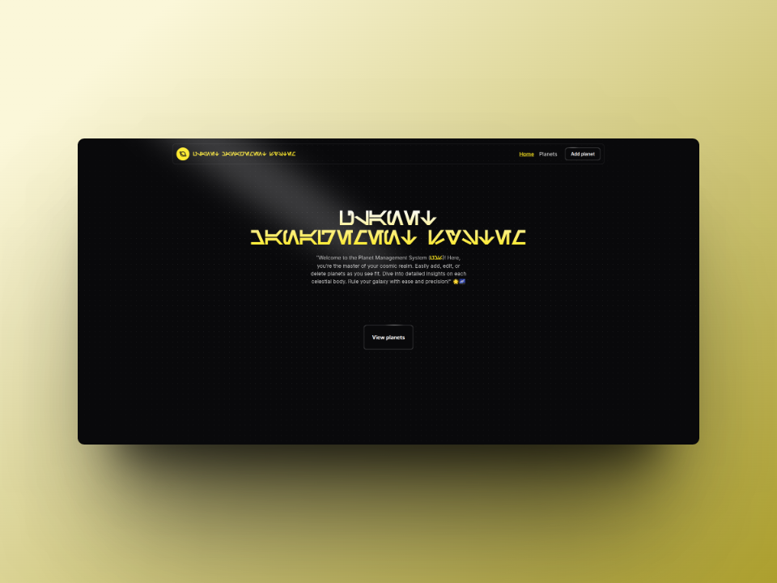
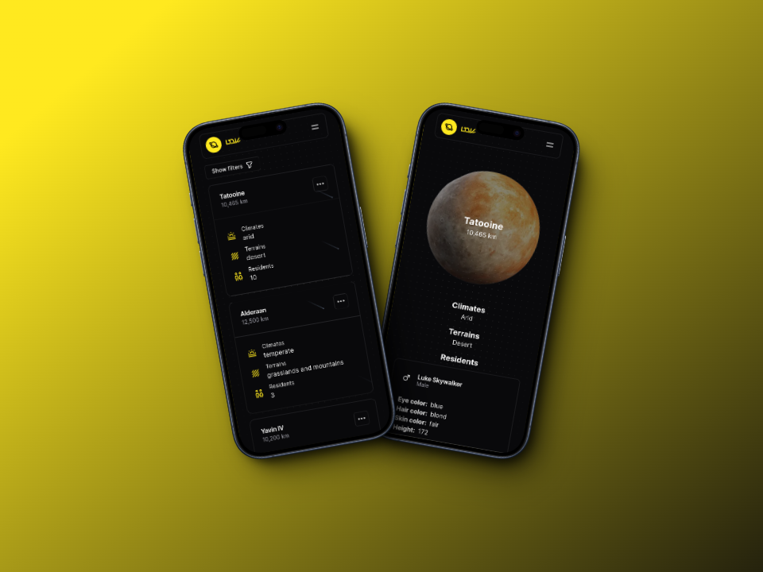

<details>
<summary>Table of contents</summary>

- [Screenshots](#screenshots)
- [To start](#to-start)
  - [Prerequisites](#prerequisites)
  - [Installation](#installation)
  - [Testing](#testing)
  - [Docker](#docker)

</details>


----

# Screenshots




# To start

## Prerequisites

- Node > 20 version. You can use [NVM](https://github.com/nvm-sh/nvm?tab=readme-ov-file#installing-and-updating) to setup a node version manager

- Package manager
  - PNPM
    ```sh
    npm install -g pnpm
    ```

  - NPM
    ```sh
    npm install -g npm@latest
    ```

  - YARN
    ```sh
    npm install -g yarn
    ```

## Installation  

> If you are going to use a package manager other than "pnpm" run this command before you begin `rm -rf node_modules && rm pnpm-lock.yaml`

1. Clone the repository
    ```sh
    git clone https://github.com/alevidals/pms-codetest.git
    ```

2. Install the packages (You can use `npm` or `yarn` instead of `pnpm` if you like)
    ```sh
    pnpm install
    ```

3. Execute the project (You can use `npm` or `yarn` instead of `pnpm` if you like)
    ```sh
    pnpm run dev
    ```

## Testing
- Unit tests. (You can use `npm` or `yarn` instead of `pnpm` if you like)

    ```sh
    pnpm run test:unit
    ```

- Integration tests. (You can use `npm` or `yarn` instead of `pnpm` if you like)

    ```sh
    pnpm run test:integration
    ```

- E2E tests. (You can use `npm` or `yarn` instead of `pnpm` if you like)

    ```sh
    pnpm run test:e2e
    ```

## Docker

1. Build the container
    ```sh
    docker build -t <tag>
    ```

2. Run the container
    ```sh
    docker run -p 3000:3000 <tag>
    ```